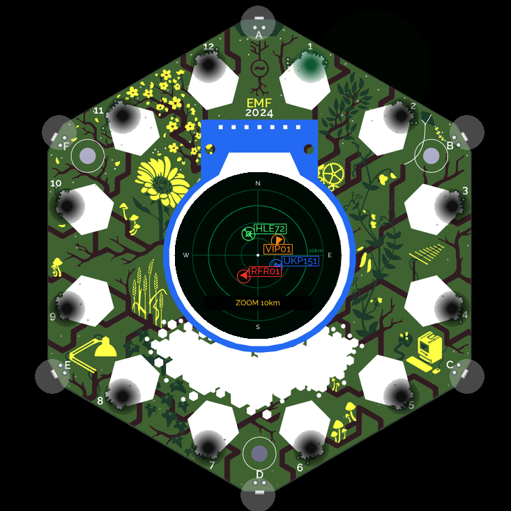
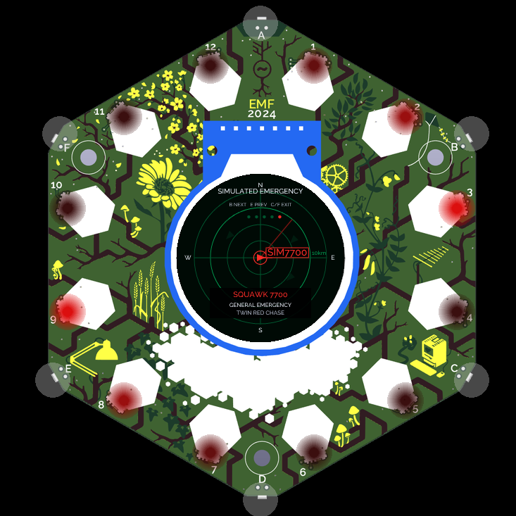
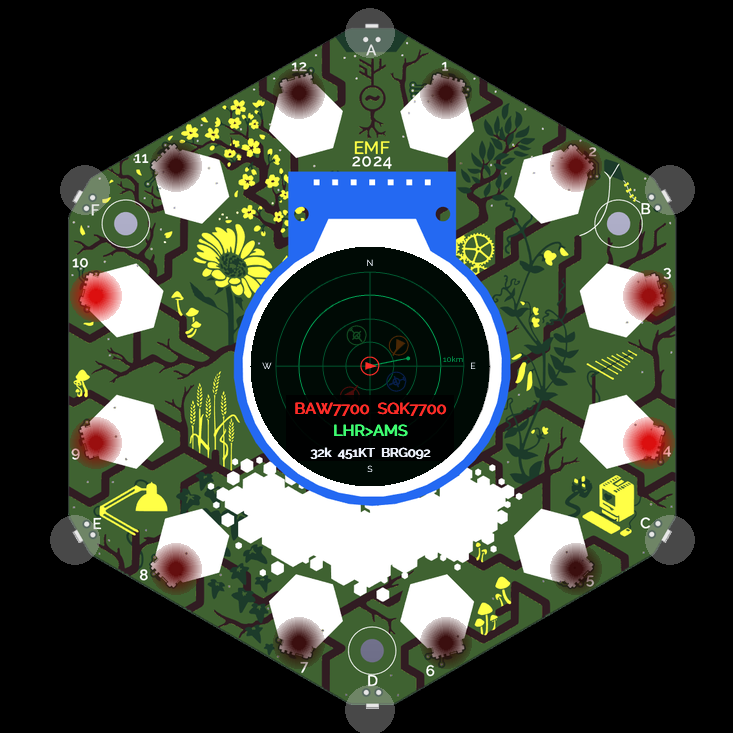
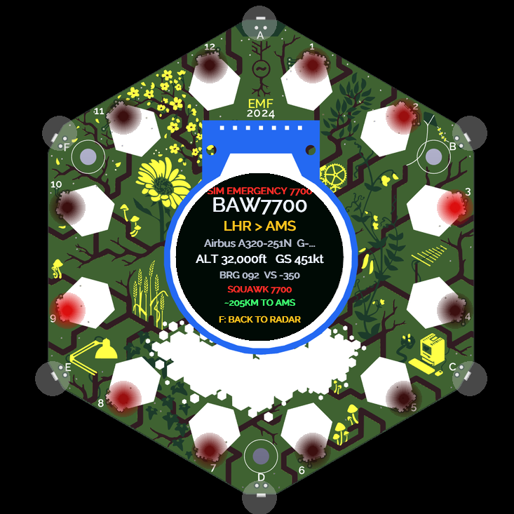

# Plane Radar for Tildagon

Live aircraft on the round Tildagon display, with a radar sweep across the badge LEDs.

Plane Radar uses public ADS-B data to show nearby traffic around your location. It can find a position from GPS, an approximate Wi-Fi lookup, or a UK postcode, and it can leave the local radar to follow a particular flight.

This is a native MicroPython port of [MatixYo/ESP32-Plane-Radar](https://github.com/MatixYo/ESP32-Plane-Radar), adapted for Tildagon by Mark Brown with assistance from OpenAI Codex.

## Highlights

- live nearby aircraft from [adsb.fi](https://opendata.adsb.fi/)
- GPS → Wi-Fi estimate → saved postcode/manual location fallback
- readable, round-screen-safe setup and warning screens
- callsigns, colour-matched labels, classified aircraft symbols and fading trails
- highlighted interesting traffic, including gentle directional LED cues for recognised emergency-service and military aircraft
- animated on-badge traffic guide, opened with B during the splash screen
- optional origin/destination labels from [adsbdb.com](https://www.adsbdb.com/)
- flight-follow mode with route, progress and aircraft details
- emergency-squawk focus with a fast twin-red chase around the LED ring
- saved manual badge bearing, configurable green LED sweep brightness and bearing-aligned traffic lights
- optional Keepdexpansion alert lighting, ambient EEH Logo and Spaceagon controls
- compatible with the original 2024 Tildagon without any expansion

Plane Radar is a fun visualisation, not an authoritative air-traffic or emergency-alert system.

## Screenshots

| Live radar | Animated Traffic Guide |
|---|---|
|  |  |
| Emergency flight following | Large flight details |
|  |  |

## Install

Open **App Store** on the badge, choose **CodeInstall**, and enter:

```text
03224321
```

See the permanent [Plane Radar App Store page](https://apps.badge.emfcamp.org/apps/03224321) for the button sequence and web emulator. Tildagon manages the installed files and future updates.

For development or hardware testing, copy all of the root Python files plus `tildagon.toml` into `/apps/plane_radar/` with `mpremote`, then reset the badge. The detailed manual includes simulator instructions and troubleshooting.

## Getting started

On startup, Plane Radar tries location sources in this order:

1. a compatible GPS/Position provider;
2. an approximate Wi-Fi position from BeaconDB;
3. the last saved postcode or manual coordinates.

A rough Wi-Fi result is clearly labelled before use. Press **C** to open Radar Options and choose automatic location, UK postcode, decimal coordinates, manual badge bearing, onboard LED settings, or the optional Hexpansion-light settings. Postcodes are resolved through [Postcodes.io](https://postcodes.io/) without an API key.

The splash remains visible for about five seconds. Press **B/Right during the splash screen** to open the animated Traffic Guide. It introduces the recognised colours and aircraft symbols one by one, ending with a clearly simulated 7700 focus; the same guide is always available from Radar Options.

## Controls

| Control | Radar action |
|---|---|
| Right | Change range |
| Left | Refresh aircraft |
| Up | Toggle kilometres/miles |
| Down | Retry GPS, then Wi-Fi positioning |
| C / Confirm | Open Radar Options or select |
| Left + Right | Open Follow Flight |
| F / Back | Minimise or return |

Keyboard arrows and Enter work in menus and entry screens. With Keepdexpansion, start typing a callsign or flight number directly from the radar and submit with Enter; Escape goes back. Press keyboard **Down** on the normal radar to open a selectable list of visible aircraft and their known routes, then press Enter to follow one. Physical Down retains its location-refresh action.

The default range is 10 km, with 2, 5, 10 and 15 km options. Spaceagon proximity controls can adjust the range, touch sensors can select traffic by direction, and its joystick maps to the standard controls.

The bottom card shows the current zoom rather than a traffic count. With no aircraft in range, a brighter green on-screen sweep keeps the empty radar visibly active. Commercial/civilian traffic uses the familiar filled triangle; GA uses a hollow diamond, helicopters a rotor symbol, and military aircraft a broad delta when the ADS-B feed supplies enough classification data.

## Hexpansion lighting

Plane Radar deliberately does not turn the optional Keepdexpansion keyboard or 14-pixel East Essex Hackspace Logo into another traffic display. Ordinary aircraft do not claim either expansion. During startup, available unclaimed lights show a short green radar flourish. Plane Radar then restores the keyboard's previous colour or pattern.

The EEH Logo is handed straight back whenever its official background controller is running. If no controller is available and Plane Radar has an explicitly configured Logo port, it falls back to a slow green-and-cyan aurora orbit with no data meaning. Genuine highlighted traffic temporarily takes over both available expansions: green for air ambulance, blue for police, red for military and amber for other interesting traffic. The keyboard becomes a calm full-colour field; the Logo sweeps that colour. A 7700 focus uses red alert lighting and the Logo's twin-red chase. The animated Traffic Guide previews the same alerts.

These effects are independent of the onboard LED sweep. They default to **100% for the keyboard** and a gentler **10% for the EEH Logo**. Use **Radar Options > Hex FX / Key Level / Logo Level** to disable them or set their peak brightness separately; the Logo offers 5%, 10%, 25%, 50%, 75% and 100%.

For the EEH Logo, **Auto** honours the port already saved by the official EEH NeoPixel controller. If that has not been configured, **EEH Logo** can cycle through Off and Ports 1–6. Select a manual port only when you know the 14-pixel Logo is connected there; Plane Radar never guesses or probes an unknown Hexpansion port.

## Flight following and emergencies

Follow Flight accepts an operational callsign or many familiar passenger flight numbers. When the aircraft is found, the radar follows it and alternates with a deliberately sparse, extra-large flight-information screen. Available route data is approximate and may be absent or incorrect.

The local radar watches the standard `7500`, `7600` and `7700` squawks. It also makes a lightweight regional check for `7700` aircraft within 500 km. An alert enters focused flight-following: the aircraft stays centred, surrounding traffic remains as dim unlabeled context, and the radar alternates with its flight details. F/Back returns immediately to the local radar; a real alert also returns automatically after three consecutive target-feed misses. A fast pair of opposing red comets circles the LED ring, visibly distinct from the slower, broader military sweep. Typing `7700` in Follow Flight simulates the feature with a visible aircraft for testing.

Aircraft marked interesting by the ADS-B database receive a fine coloured halo. Recognised UK air-ambulance, police and military traffic also produces a slow directional pulse at its bearing: green for air ambulance, blue for police and red for military. When several different special categories are present, the ring presents a full sweep of each colour in turn so the signals remain clear. These best-effort classifications depend on incomplete public metadata and must not be used as an operational alert.

## Network and privacy

The app may contact:

- **adsb.fi** for live aircraft positions;
- **adsbdb.com** for optional route metadata;
- **BeaconDB** for approximate Wi-Fi positioning;
- **Postcodes.io** for UK postcode lookup.

Wi-Fi positioning can send nearby access-point identifiers and signal strengths to BeaconDB. It is requested only while resolving location, not continuously. Route results are held in a small in-memory cache for the current app session. No API keys are required.

## Documentation and development

See [TILDAGON.md](TILDAGON.md) for the full user manual, location behaviour, expansion controls, simulator setup, testing notes and implementation details.

Host-side tests:

```sh
python -m unittest discover -s tests -v
```

The original ESP32-C3/Arduino source remains in `src/`, `include/`, `data/` and `scripts/` to preserve the upstream project and its history. Those files are excluded from the Tildagon App Store package through `.gitattributes`.

## Credits and licence

Plane Radar was created by **MatixYo** and released under the MIT licence. Thank you to MatixYo for making the original project available to enjoy, learn from and adapt.

The Tildagon edition was adapted by **Mark Brown**, with design, implementation, testing and documentation assistance from **OpenAI Codex**. AI assistance does not replace or diminish the original project's authorship or licence.

See [LICENSE](LICENSE) for the original copyright and MIT licence notice.
